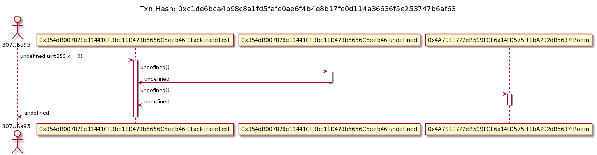

Modifications to run the tx2seq plugin.

# Manual testing method
  1. start fresh instance of ganache-cli (port 8545) in a separate terminal/pane
  1. execute truffle test then run all transactions through the plugin
     ```
     $ truffle test
     $ node ganache_transactions.js| grep -v done | xargs -n 1 truffle run tx2seq
     ```

# Generated UMLs

Adding the images and uml to the readme is not yet painful enough to automate.
The generated plantuml URL goes to an `svg` endpoint. replace `svg` with `png`
and you're off to the races.

```sh

$ wget https://www.planttext.com/api/plantuml/svg/BLAH # becomes ...
$ wget https://www.planttext.com/api/plantuml/png/BLAH -O pong.png
# which saves the png locally

```

##


<details><summary>Generated Plantuml</summary>

```
@startuml

title Txn Hash: 0x0e5e23a89fcf099cc13d186ec9681934ca71d29b40f8daf53b74f0323533ec4d

actor eow as "307..Ba95"
participant p1 as "0x47439d513218ba0337FE24083c4a24A65FbD7218:Migrations"

eow -> p1 ++ : setCompleted(uint256 completed = 2)
p1 -> eow -- :

@enduml
```

</details>

##


<details><summary>Generated Plantuml</summary>

```
@startuml

title Txn Hash: 0x127345e1c938aac97c3beb5366b0b0084dad8a7661b91bafeca5cda471b6c298

actor eow as "307..Ba95"
participant p1 as "0x47439d513218ba0337FE24083c4a24A65FbD7218:Migrations"

eow -> p1 ++ : undefined()
p1 -> eow -- : undefined

@enduml
```

</details>

##


<details><summary>Generated Plantuml</summary>

```
@startuml

title Txn Hash: 0x34ebc426d02206d1b665930b1a171b63256699bbdda0bd0b1b24228909489afd

actor eow as "307..Ba95"
participant p1 as "0x47439d513218ba0337FE24083c4a24A65FbD7218:Migrations"

eow -> p1 ++ : setCompleted(uint256 completed = 3)
p1 -> eow -- :

@enduml
```

</details>

##


<details><summary>Generated Plantuml</summary>

```
@startuml

title Txn Hash: 0x6601e9f418ea180a0ee2e0b6eeb1df201f6e37620da40be603c66e7d8474d958

actor eow as "307..Ba95"
participant p1 as "0xb387d49E8D9F33cF83e65D02Cf0A1442DAB9f62f:Library"

eow -> p1 ++ : undefined()
p1 -> eow -- : undefined

@enduml
```

</details>


##

<details><summary>Generated Plantuml</summary>

```
@startuml

title Txn Hash: 0x93b44f2999a7697ce6f4a5586225d2ef741e4e4c83f8810e13ac563903c336f4

actor eow as "307..Ba95"
participant p1 as "0x47439d513218ba0337FE24083c4a24A65FbD7218:Migrations"

eow -> p1 ++ : setCompleted(uint256 completed = 1)
p1 -> eow -- :

@enduml
```

</details>


##


<details><summary>Generated Plantuml</summary>

```
@startuml

title Txn Hash: 0xb125b60890727fe065336343c8b510aeb0b93f075f95cb8164bd7f6f8ea7d21c

actor eow as "307..Ba95"
participant p1 as "0x0701423B07565B0B546101b7cA45E9382964A140:VizTest"

eow -> p1 ++ : undefined()
p1 -> eow -- : undefined

@enduml
```

</details>


##


<details><summary>Generated Plantuml</summary>

```
@startuml

title Txn Hash: 0xb828d748b7ec4e5790285d6c364cd82a8f0e40f3ede31f83f1d6059fb12c31ac

actor eow as "307..Ba95"
participant p1 as "0xE0CA7a10E8fcFde9746fE08a78427855680Fe785:InternalTest"

eow -> p1 ++ : undefined()
p1 -> eow -- : undefined

@enduml
```

</details>

##



<details><summary>Generated Plantuml</summary>

```
@startuml

title Txn Hash: 0xc1de6bca4b98c8a1fd5fafe0ae6f4b4e8b17fe0d114a36636f5e253747b6af63

actor eow as "307..Ba95"
participant p1 as "0x354dB007878e11441CF3bc11D478b6656C5eeb46:StacktraceTest"
participant p2 as "0x354dB007878e11441CF3bc11D478b6656C5eeb46:undefined"
participant p3 as "0x4A7913722eB599FCE6a14fD575ff1bA292dB5687:Boom"

eow -> p1 ++ : undefined(uint256 x = 0)
p1 -> p2 ++ : undefined()
p2 -> p1 -- : undefined
p1 -> p3 ++ : undefined()
p3 -> p1 -- : undefined
p1 -> eow -- : undefined

@enduml
```

</details>
